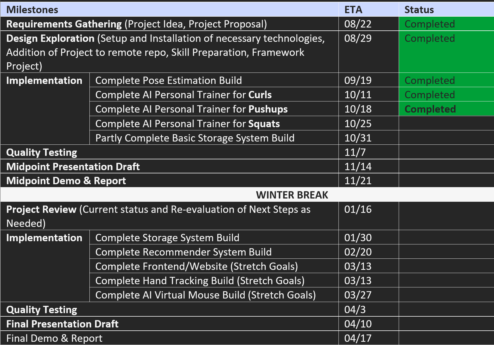

# **AI-FitnessTrainer**
An AI personal fitness trainer embedded with a storage &amp; recommender system and an AI virtual mouse.


## **Background**:
This project serves as an opportunity to enhance learning and exposure to the exciting computer vision field. Today, we see our technologies like computer vision can be applied in automating our everyday activities and the process of getting fit is not excluded. For instance, taking on activities like bouldering and hiking to stay fit was not a huge success for me. If I had an AI Fitness Trainer, accomplishing my fitness goals would have been much easier. Thus, this project is a win-win, as the developer gets to enhance their experience while working on something they are super interested in, and the users get a fantastic product that satisfies their need.

## **Goals**: 
**TL; DR**: The goal of the project can be summarized as developing an AI fitness trainer embedded with storage and recommender systems and an AI virtual mouse.

The AI fitness trainer will help the user lose weight, gain muscle, and accomplish other fitness goals. In addition, it'd attempt to understand the client goals, develop a fitness routine, recommend a healthy eating plan, and ensure all exercises are performed correctly.

## **Requirements**:
This section lists all the requirements to be completed for the project and their priority levels (0 – must have, 1 – partial progress must have, 2 – nice to have if time permits).


## **Timeline**:
This section lists the milestones of the project spread across two semesters (Fall 2022 and Spring 2023).

.

## Run the Trainer:

```
python Trainer.py
```

## **References**:
Project Proposal: [Project Proposal](ProgressReports/project_proposal.docx)

MediaPipe Pose Solutions [MediaPipe Pose Solutions](https://google.github.io/mediapipe/solutions/pose.html)

More on MediaPipe BlazePose GHUM 3D Model [More on MediaPipe Pose Model](https://drive.google.com/file/d/10WlcTvrQnR_R2TdTmKw0nkyRLqrwNkWU/preview)

